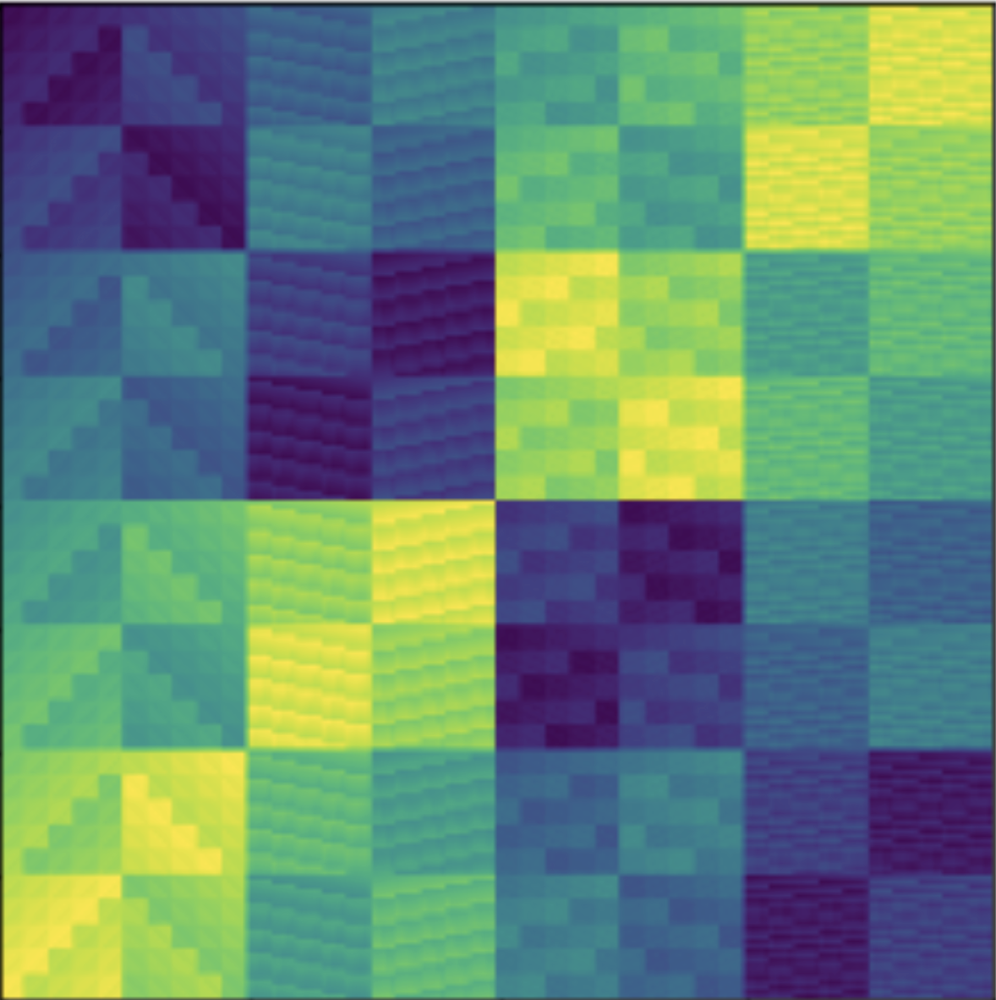

# Implicit Regularization of Linear Equivariant Networks.

This is code to accompany the research paper https://arxiv.org/abs/2110.06084

## Usage

The code itself has many comments explaining its functionality, but we also show here at a high level the workflow to recreate our results. We proceed in three basic steps.

> GAP computations

We use GAP language to do computations over groups and group representations in `fourierbasisdecomp.g` which writes output information as a string to a text file. Example outputs for some small dihedral and cyclic groups can be found in the `data/` folder. The minimal change to use a custom group is to change line `fourierbasisdecomp.g.52` from

    G := DihedralGroup(8);

To
    
    G := <your-group-here>

And rename the output text file on line $54$. It will be necessary to modify `get_cayley.g` in the same way to set $G$ to the desired group. Run both GAP scripts to generate output files in `data/`

>Sage parsing

 We then use the Sage script `gap_parsing.sage` to translate the data into a NumPy binary format more amenable to the later steps in the pipeline. If the GAP output file is formatted correctly no changes should be necessary to this file. However, it may be desirable to comment out lines $96$ and onward, as these are only used to produce example visualizations.

> Model training with PyTorch

To reproduce the results from our experiments section, simply run all the cells in `experiments_section.ipynb`. If a custom group is desired, the irrep dimensions, Cayley table, and Fourier basis matrix will be needed. All these should be generated from the previous steps in the pipeline.

Once `.npy` files are obtained for the necessary data, modify in `src/nn_training.py` the class methods `Group.get_order()` and `Group.get_irrep_sizes()` to include a name for your group together with its order and irrep dimensions respectively.

Then, back in `experiments_section.ipynb` wherever a group is initalized as

    g = Group(<one-of-our-groups>)

Change it to

    g = Group(<your-favorite-new-shiny-group>)

And run all the cells to see the results!
> Dependencies

Here are installation guides for [GAP](https://www.gap-system.org/Download/) and [Sage](https://doc.sagemath.org/html/en/installation/). Some of the features we rely on may not be supported in earlier versions, so the latest release is strongly recommended. Some of these dependencies are for visualzations only, so if only the core functionality is needed they can be skipped.

* GAP 4.11.0 or later
* PyTorch 1.9.0 or later 
* Numpy 1.21 or later
* Sage
* Pandas
* Matplotlib
* Seaborn

> Pretty pictures

| 
| :--: |
<b> Cayley table for the nonabelian group $(C_5 \times C_5) \rtimes Q_8$</b>
